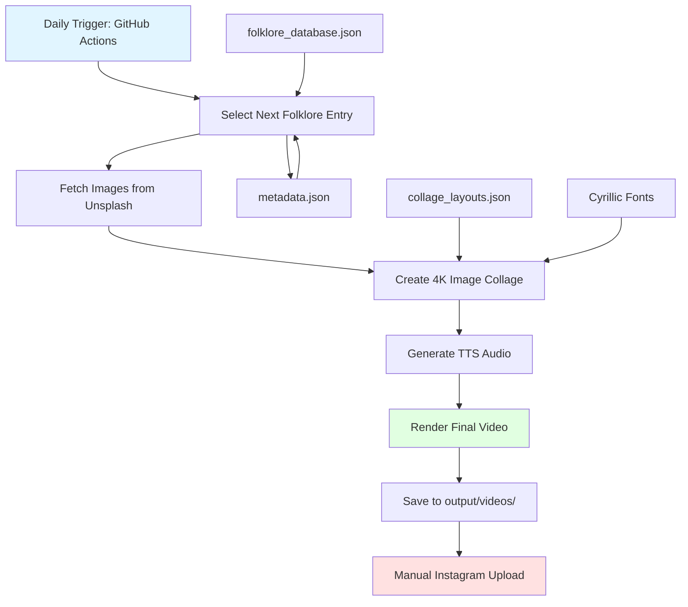
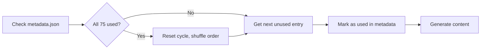
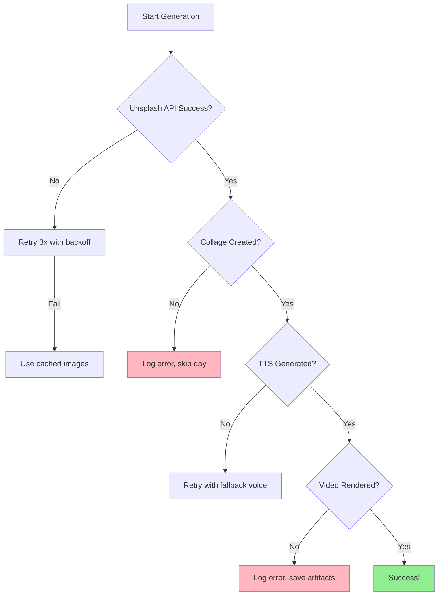

# Folklorovich 🪆

An automated Russian folklore content system that generates daily 30-second Instagram reels using 100% free-tier services.

## 📖 Project Overview

Folklorovich creates engaging short-form video content about Russian folklore, spirits, creatures, superstitions, rituals, and heroes. Inspired by the successful "The17Project" (angel numbers content), this system automates the entire content creation pipeline from script generation to final video rendering.

**Key Features:**
- 75 unique Russian folklore pieces (75-day rotation cycle)
- 4K image collages from Unsplash API
- Natural Russian voice narration via Edge TTS
- 8 distinct visual templates
- Fully automated daily content generation
- **$0/month operating cost** (all free-tier services)

## 🎯 Goals

1. **Educational**: Preserve and share Russian folklore with modern audiences
2. **Automated**: Generate daily content without manual intervention
3. **Free**: Use only free-tier services (no budget required)
4. **Quality**: Produce Instagram-ready 1080x1920 vertical videos
5. **Scalable**: Easy to expand with more folklore entries

## 🏗️ Architecture



### Content Rotation Algorithm



### Error Handling Flow



## 💰 Free-Tier Cost Breakdown

| Service | Usage | Cost | Limits |
|---------|-------|------|--------|
| **Unsplash API** | Image downloads | $0 | 50 requests/hour (unlimited with 10s delay) |
| **Edge TTS** | Voice synthesis | $0 | Unlimited (Microsoft's free API) |
| **GitHub Actions** | Daily automation | $0 | 2,000 minutes/month (enough for 500+ runs) |
| **FFmpeg** | Video rendering | $0 | Open-source, local processing |
| **Python Libraries** | Image/audio processing | $0 | All open-source |
| **Claude API** (optional) | Future content expansion | Free tier | 50 requests/day |
| **TOTAL** | | **$0/month** | |

## 🚀 Setup Instructions

### Prerequisites

- Python 3.10+ installed
- FFmpeg installed (for video rendering)
- Git installed
- Unsplash API account (free)

### 1. Install FFmpeg

**macOS:**
```bash
brew install ffmpeg
```

**Ubuntu/Debian:**
```bash
sudo apt update
sudo apt install ffmpeg
```

**Windows:**
Download from [ffmpeg.org](https://ffmpeg.org/download.html) and add to PATH

### 2. Clone Repository

```bash
cd ~/Desktop
git clone <your-repo-url> folklorovich
cd folklorovich
```

### 3. Create Virtual Environment

```bash
python3 -m venv venv
source venv/bin/activate  # On Windows: venv\Scripts\activate
```

### 4. Install Dependencies

```bash
pip install --upgrade pip
pip install -r requirements.txt
```

### 5. Configure API Keys

```bash
cp .env.template .env
```

Edit `.env` and add your credentials:
```env
UNSPLASH_ACCESS_KEY=your_unsplash_access_key_here
CLAUDE_API_KEY=your_claude_api_key_here  # Optional, for future use
```

**Get Unsplash API Key:**
1. Go to [https://unsplash.com/developers](https://unsplash.com/developers)
2. Register as a developer (free)
3. Create a new application
4. Copy the "Access Key"

### 6. Populate Folklore Database

Edit `content/folklore_database.json` and add your 75 folklore entries following the schema (see below).

### 7. Test Local Generation

```bash
python scripts/generate_daily_content.py
```

Check `output/videos/` for the generated video.

### 8. Setup GitHub Actions (Optional)

If you want automated daily generation:

1. Fork/push this repo to GitHub
2. Go to Settings → Secrets → Actions
3. Add `UNSPLASH_ACCESS_KEY` secret
4. GitHub Actions will run daily at 9 AM UTC

## 📁 File Structure

```
folklorovich/
├── README.md                      # This file
├── .env.template                  # Environment variables template
├── .env                          # Your actual API keys (git-ignored)
├── .gitignore                    # Git ignore rules
├── requirements.txt              # Python dependencies
│
├── content/
│   ├── folklore_database.json    # 75 folklore entries with metadata
│   └── metadata.json             # Tracks used entries, statistics
│
├── scripts/
│   ├── generate_daily_content.py # Main orchestrator script
│   ├── fetch_images.py           # Unsplash API image downloader
│   ├── create_collage.py         # 4K image collage generator
│   ├── generate_voice.py         # Edge TTS voice synthesis
│   └── render_video.py           # FFmpeg video composer
│
├── assets/
│   ├── fonts/                    # Cyrillic-compatible fonts
│   │   ├── Roboto-Regular.ttf
│   │   ├── Roboto-Bold.ttf
│   │   └── Philosopher-Regular.ttf
│   └── templates/
│       └── collage_layouts.json  # 8 collage template definitions
│
├── output/                       # Generated content (git-ignored)
│   ├── images/                   # Downloaded Unsplash images
│   ├── audio/                    # Generated TTS audio files
│   └── videos/                   # Final rendered videos
│
└── .github/
    └── workflows/
        └── daily_generation.yml  # GitHub Actions automation
```

## 📋 Folklore Database Schema

Each entry in `content/folklore_database.json`:

```json
{
  "folklore": [
    {
      "id": "001",
      "name": "Domovoi",
      "type": "house_spirit",
      "region": "All Russia",
      "story_short": "The house spirit who lives behind the stove and protects families who respect him.",
      "story_full": "В каждом русском доме живёт домовой — хранитель очага и семейного благополучия. Он живёт за печкой, следит за порядком и помогает хозяевам. Но если его разозлить, может напустить беды. Чтобы задобрить домового, оставляйте ему молоко и хлеб на ночь.",
      "story_full_en": "In every Russian home lives a domovoi - guardian of the hearth and family wellbeing. He lives behind the stove, watches over order, and helps the household. But if angered, he can bring troubles. To appease the domovoi, leave him milk and bread at night.",
      "moral": "Respect your home and it will protect you",
      "keywords": ["spirit", "house", "fireplace", "guardian", "protection"],
      "visual_tags": ["cozy_interior", "fireplace", "old_wooden_house", "mystical", "warm_light"],
      "voice_tone": "warm_grandfather",
      "duration_target": 28,
      "category": "household_spirit"
    }
  ]
}
```

**Field Descriptions:**
- `id`: Unique 3-digit identifier (001-075)
- `name`: Folklore entity name (transliterated)
- `type`: Classification (spirit/creature/hero/ritual/superstition)
- `region`: Geographic origin
- `story_short`: 2-3 sentence hook for English audiences
- `story_full`: Complete 30-second narration script in Russian
- `story_full_en`: English translation for reference
- `moral`: Key takeaway/lesson
- `keywords`: SEO/hashtag keywords
- `visual_tags`: Unsplash search terms for image fetching
- `voice_tone`: TTS voice profile to use
- `duration_target`: Target duration in seconds (±2s tolerance)
- `category`: Grouping for analytics

## 🎨 Visual Templates

8 collage layouts defined in `assets/templates/collage_layouts.json`:

1. **grid_4**: Classic 2x2 grid with equal quadrants
2. **diagonal_split**: Diagonal division with 2 images
3. **vintage_frame**: Central image with decorative border images
4. **minimalist_3**: Large hero image with 2 accent images
5. **ornate_border**: Traditional Russian ornamental frame
6. **vertical_story**: 3 vertically stacked images
7. **horizontal_panorama**: Wide landscape composition
8. **mystical_overlay**: Layered semi-transparent images

Each template includes:
- Image positions (x, y, width, height)
- Text overlay zones
- Font specifications
- Color schemes

## 🎙️ Voice Profiles

Edge TTS voice options for different folklore types:

- `warm_grandfather`: `ru-RU-DmitryNeural` (friendly, storytelling)
- `mysterious_elder`: `ru-RU-SvetlanaNeural` (slow, enigmatic)
- `energetic_youth`: `ru-RU-DariyaNeural` (upbeat, modern)
- `solemn_narrator`: `ru-RU-DmitryNeural` (formal, serious)

## 🔄 Daily Workflow

1. **9:00 AM UTC**: GitHub Actions triggers
2. **Content Selection**:
   - Check `metadata.json` for next unused entry
   - If all 75 used, reset cycle with shuffled order
3. **Image Fetching**:
   - Query Unsplash API with `visual_tags`
   - Download 4-8 images per template requirements
   - Cache locally in `output/images/YYYY-MM-DD/`
4. **Collage Creation**:
   - Select random layout from 8 templates
   - Compose 1080x1920 vertical collage
   - Add text overlays (title, moral)
   - Apply filters/effects
5. **Voice Generation**:
   - Pass `story_full` to Edge TTS
   - Select voice profile based on `voice_tone`
   - Generate MP3 audio file
   - Verify duration matches `duration_target`
6. **Video Rendering**:
   - Combine collage + audio with FFmpeg
   - Add fade in/out transitions
   - Export 1080x1920 MP4 (H.264, 30fps)
7. **Output**:
   - Save to `output/videos/YYYY-MM-DD_folklore-name.mp4`
   - Update `metadata.json` with success status
8. **Manual Upload**:
   - Download video from GitHub Actions artifacts
   - Post to Instagram with generated hashtags

## 🛠️ Script Descriptions

### `generate_daily_content.py`
Main orchestrator that runs the entire pipeline:
- Loads environment variables
- Selects next folklore entry
- Calls other scripts in sequence
- Handles errors and logging
- Updates metadata

### `fetch_images.py`
Downloads images from Unsplash:
- Accepts visual tags as input
- Queries Unsplash API (50/hour rate limit)
- Downloads high-resolution images
- Implements retry logic and caching
- Returns list of local image paths

### `create_collage.py`
Creates 4K image collages:
- Loads layout template
- Positions images according to template
- Adds text overlays (title, moral)
- Applies visual effects (borders, filters)
- Outputs 1080x1920 PNG

### `generate_voice.py`
Synthesizes Russian narration:
- Uses Edge TTS (free, unlimited)
- Supports multiple voice profiles
- Adjusts speed to match duration target
- Outputs MP3 audio file
- Validates audio duration

### `render_video.py`
Combines collage + audio into video:
- Uses FFmpeg subprocess
- Adds fade in/out effects
- Sets Instagram-optimized encoding
- Outputs 1080x1920 MP4
- Validates video integrity

## 🔍 Troubleshooting

### FFmpeg Not Found
**Error**: `FileNotFoundError: ffmpeg not found`

**Solution**: Install FFmpeg and ensure it's in PATH:
```bash
# Verify installation
ffmpeg -version

# If not found, install (macOS):
brew install ffmpeg
```

### Unsplash Rate Limit
**Error**: `429 Too Many Requests`

**Solution**: The free tier allows 50 requests/hour. Script automatically:
- Waits 10 seconds between requests
- Caches downloaded images
- Retries with exponential backoff

### Edge TTS Connection Error
**Error**: `Cannot connect to Edge TTS service`

**Solution**: Edge TTS requires internet connection. Check:
```bash
# Test connection
ping speech.platform.bing.com

# Try manual TTS
edge-tts --text "Тест" --voice ru-RU-DmitryNeural --write-media test.mp3
```

### Missing Cyrillic Font
**Error**: `Font does not support Cyrillic characters`

**Solution**: Use included fonts in `assets/fonts/`:
- Roboto (supports Cyrillic)
- Philosopher (Russian-style decorative)

### Video Duration Mismatch
**Issue**: Video is too short/long

**Solution**: Adjust `duration_target` in folklore entry or modify TTS speed:
```python
# In generate_voice.py
rate = "+10%"  # Faster speech
rate = "-10%"  # Slower speech
```

### GitHub Actions Failing
**Error**: Workflow fails in Actions tab

**Solution**:
1. Check secrets are set (UNSPLASH_ACCESS_KEY)
2. Review Actions logs for specific error
3. Test locally first: `python scripts/generate_daily_content.py`
4. Ensure FFmpeg is installed in workflow (see `.github/workflows/daily_generation.yml`)

## 📊 Metadata Tracking

`content/metadata.json` tracks:
```json
{
  "last_used_id": "023",
  "last_generated_date": "2025-12-05",
  "cycle_number": 1,
  "used_ids_this_cycle": ["001", "007", "015", "023"],
  "total_videos_generated": 42,
  "statistics": {
    "most_popular_category": "household_spirit",
    "average_generation_time_seconds": 45,
    "failed_generations": 2
  }
}
```

## 🎬 Instagram Posting Tips

1. **Optimal Times**: Post 9-11 AM or 7-9 PM Moscow time
2. **Hashtags**: Auto-generated from `keywords` field:
   ```
   #russianfolklore #славянскаямифология #folklore #mythology
   #domovoi #домовой #russianculture #folktales
   ```
3. **Caption Template**:
   ```
   [Story_short in English]

   🪆 [Name] | Russian Folklore
   📍 Region: [region]

   [Hashtags]
   ```
4. **Engagement**: Pin first comment with English translation
5. **Series**: Use consistent branding (same filter, intro/outro)

## 🔮 Future Enhancements

- [ ] Add English subtitles via Whisper API
- [ ] Implement A/B testing for visual templates
- [ ] Auto-post via Instagram Graph API (requires business account)
- [ ] Generate carousel posts for longer stories
- [ ] Add background music (royalty-free Russian folk music)
- [ ] Create TikTok/YouTube Shorts variants
- [ ] Use Claude API to expand database to 365 entries
- [ ] Add analytics dashboard
- [ ] Implement user suggestions via comments parsing

## 📜 License

MIT License - Free to use, modify, and distribute.

## 🤝 Contributing

Contributions welcome! Please:
1. Fork the repository
2. Create a feature branch
3. Add folklore entries or improve scripts
4. Submit pull request with description

## 📧 Contact

Questions? Open an issue on GitHub.

---

**Made with ❤️ for preserving Russian folklore | Сделано с любовью к русскому фольклору**
