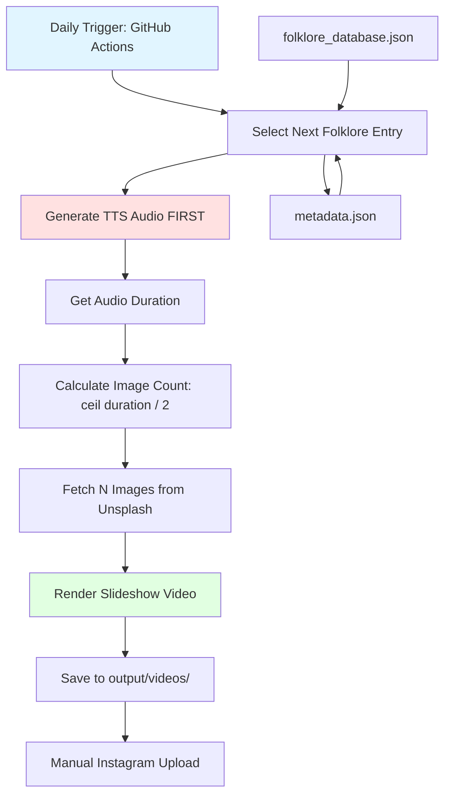

# Folklorovich 🪆

An automated Russian folklore content system that generates daily 25-30 second Instagram reels using 100% free-tier services.

## 📖 Project Overview

Folklorovich creates engaging short-form video content about authentic Russian superstitions with culturally appropriate visuals. This system automates the entire content creation pipeline from script generation to final video rendering.

**Version 2.0 - Quality Over Quantity:**
- **20 elite Russian superstitions** (carefully curated, high-quality content)
- Each story: **80-100 words** (reads naturally in 25-30 seconds)
- **Russian cultural authenticity**: Visual keywords focus on wooden houses, Orthodox churches, birch forests, folk art
- **Dynamic slideshow videos** with 2-second image changes
- Smooth crossfade transitions (0.5s)
- Images fetched from Unsplash API (dynamic count based on audio duration)
- Natural Russian voice narration via Edge TTS
- Text overlays with superstition titles
- Fully automated daily content generation
- **$0/month operating cost** (all free-tier services)

## 🎯 Goals

1. **Educational**: Preserve and share authentic Russian superstitions with modern audiences
2. **Automated**: Generate daily content without manual intervention
3. **Free**: Use only free-tier services (no budget required)
4. **Quality**: Produce Instagram-ready 1080x1920 vertical videos with culturally authentic imagery
5. **Authentic**: Focus on Russian cultural visuals (not generic stock photos)

## 🏗️ Architecture

**NEW SLIDESHOW WORKFLOW:**



**Key Change:** Audio is generated FIRST to determine how many images are needed (1 image per 2 seconds).

### Content Rotation Algorithm


**20-Day Cycle**: After all 20 superstitions are used, the cycle resets with a shuffled order for variety.

### Slideshow Video Pipeline

**Step 1: Generate Audio**
- TTS narration created with Russian voice
- Duration measured (e.g., 26.4 seconds)

**Step 2: Calculate Image Count**
- Formula: `num_images = ceil(audio_duration / 2.0)`
- Example: 26.4s audio → 14 images needed

**Step 3: Fetch Images**
- Dynamically fetch exact number needed
- Multiple search strategies for variety
- Atmospheric keywords for folklore aesthetic

**Step 4: Render Slideshow**
- Each image displays for 2 seconds
- 0.5s crossfade between transitions
- Text overlay with folklore title
- Output matches audio duration exactly

## 💰 Free-Tier Cost Breakdown

| Service | Usage | Cost | Limits |
|---------|-------|------|--------|
| **Unsplash API** | Image downloads | $0 | 50 requests/hour (unlimited with 10s delay) |
| **Edge TTS** | Voice synthesis | $0 | Unlimited (Microsoft's free API) |
| **GitHub Actions** | Daily automation | $0 | 2,000 minutes/month (enough for 500+ runs) |
| **FFmpeg** | Video rendering | $0 | Open-source, local processing |
| **Python Libraries** | Image/audio processing | $0 | All open-source |
| **Claude API** (optional) | Future content expansion | Free tier | 50 requests/day |
| **TOTAL** | | **$0/month** | |

## 🚀 Setup Instructions

### Prerequisites

- Python 3.10+ installed
- FFmpeg installed (for video rendering)
- Git installed
- Unsplash API account (free)

### 1. Install FFmpeg

**macOS:**
```bash
brew install ffmpeg
```

**Ubuntu/Debian:**
```bash
sudo apt update
sudo apt install ffmpeg
```

**Windows:**
Download from [ffmpeg.org](https://ffmpeg.org/download.html) and add to PATH

### 2. Clone Repository

```bash
cd ~/Desktop
git clone <your-repo-url> folklorovich
cd folklorovich
```

### 3. Create Virtual Environment

```bash
python3 -m venv venv
source venv/bin/activate  # On Windows: venv\Scripts\activate
```

### 4. Install Dependencies

```bash
pip install --upgrade pip
pip install -r requirements.txt
```

### 5. Configure API Keys

```bash
cp .env.template .env
```

Edit `.env` and add your credentials:
```env
UNSPLASH_ACCESS_KEY=your_unsplash_access_key_here
CLAUDE_API_KEY=your_claude_api_key_here  # Optional, for future use
```

**Get Unsplash API Key:**
1. Go to [https://unsplash.com/developers](https://unsplash.com/developers)
2. Register as a developer (free)
3. Create a new application
4. Copy the "Access Key"

### 6. Verify Folklore Database

The database is pre-populated with 20 elite Russian superstitions. Review `content/folklore_database.json` to see the entries.

### 7. Test Local Generation

```bash
python scripts/generate_daily_content.py
```

Check `output/videos/` for the generated video.

### 8. Setup GitHub Actions (Optional)

If you want automated daily generation:

1. Fork/push this repo to GitHub
2. Go to Settings → Secrets → Actions
3. Add `UNSPLASH_ACCESS_KEY` secret
4. GitHub Actions will run daily at 9 AM UTC

## 📁 File Structure

```
folklorovich/
├── README.md                      # This file
├── .env.template                  # Environment variables template
├── .env                          # Your actual API keys (git-ignored)
├── .gitignore                    # Git ignore rules
├── requirements.txt              # Python dependencies
│
├── content/
│   ├── folklore_database.json    # 75 folklore entries with metadata
│   └── metadata.json             # Tracks used entries, statistics
│
├── scripts/
│   ├── generate_daily_content.py # Main orchestrator script
│   ├── fetch_images.py           # Unsplash API image downloader
│   ├── create_collage.py         # 4K image collage generator
│   ├── generate_voice.py         # Edge TTS voice synthesis
│   └── render_video.py           # FFmpeg video composer
│
├── assets/
│   ├── fonts/                    # Cyrillic-compatible fonts
│   │   ├── Roboto-Regular.ttf
│   │   ├── Roboto-Bold.ttf
│   │   └── Philosopher-Regular.ttf
│   └── templates/
│       └── collage_layouts.json  # 8 collage template definitions
│
├── output/                       # Generated content (git-ignored)
│   ├── images/                   # Downloaded Unsplash images
│   ├── audio/                    # Generated TTS audio files
│   └── videos/                   # Final rendered videos
│
└── .github/
    └── workflows/
        └── daily_generation.yml  # GitHub Actions automation
```

## 📋 Superstition Database Schema

Each entry in `content/folklore_database.json` (20 superstitions total):

```json
{
  "folklore": [
    {
      "id": "001",
      "name": "Black Cat Crossing Path",
      "type": "superstition",
      "region": "All Russia",
      "story_short": "A black cat's path brings misfortune unless countered with ritual.",
      "story_full": "When a black cat crosses your path from left to right, it pulls misfortune behind it like an invisible shadow. The cat sees spirits humans cannot, and its crossing marks your way with bad luck. Stop immediately. Turn around three times. Spit over your left shoulder to blind the devil watching there. Sailors would cancel voyages if a black cat boarded their ship. Better to wait than tempt fate. The ritual seems simple, but those who ignore it remember their mistake when the day turns dark.",
      "moral": "Respect old warnings and perform protective rituals to ward off bad luck.",
      "keywords": [
        "black cat", "Russian village", "wooden house", "birch forest",
        "folk art illustration", "traditional Russian painting", "fairy tale style", "Bilibin art"
      ],
      "visual_tags": [
        "black cat Russian folk art birch forest",
        "traditional wooden Russian house cat",
        "folklore illustration black cat village",
        "Russian fairy tale art style cat",
        "Palekh painting black cat nature",
        "Orthodox church village wooden cat",
        "traditional Russian interior cat samovar",
        "Bilibin style illustration mysterious cat"
      ],
      "voice_tone": "ominous",
      "duration_target": 28,
      "category": "superstition"
    }
  ]
}
```

**Field Descriptions:**
- `id`: Unique 3-digit identifier (001-020)
- `name`: Superstition name in English
- `type`: Always "superstition"
- `region`: Geographic origin (All Russia)
- `story_short`: 1-2 sentence summary
- `story_full`: **80-100 word narration** (reads naturally in 25-30 seconds)
- `moral`: Key lesson or takeaway
- `keywords`: **Russian cultural keywords** for authentic imagery
- `visual_tags`: **8-12 search phrases** combining Russian cultural elements (wooden houses, Orthodox churches, folk art, birch forests, traditional crafts)
- `voice_tone`: TTS voice profile (ominous, cautionary, stern, warm_storyteller, wise_elder, protective)
- `duration_target`: Target duration in seconds (25-30s range)
- `category`: Always "superstition"

**Visual Keyword Strategy:**
- ✅ GOOD: "Russian Orthodox church wooden interior traditional"
- ✅ GOOD: "birch forest folk art Bilibin style illustration"
- ✅ GOOD: "traditional Russian izba samovar embroidered textile"
- ❌ BAD: "construction worker" (too literal, not cultural)
- ❌ BAD: "modern office table" (not Russian authentic)
- ❌ BAD: "generic landscape" (no cultural context)

## 🎨 Visual Templates

8 collage layouts defined in `assets/templates/collage_layouts.json`:

1. **grid_4**: Classic 2x2 grid with equal quadrants
2. **diagonal_split**: Diagonal division with 2 images
3. **vintage_frame**: Central image with decorative border images
4. **minimalist_3**: Large hero image with 2 accent images
5. **ornate_border**: Traditional Russian ornamental frame
6. **vertical_story**: 3 vertically stacked images
7. **horizontal_panorama**: Wide landscape composition
8. **mystical_overlay**: Layered semi-transparent images

Each template includes:
- Image positions (x, y, width, height)
- Text overlay zones
- Font specifications
- Color schemes

## 🎙️ Voice Profiles

Edge TTS voice options for different superstition tones:

**Primary Voices:**
- `ominous`: `ru-RU-DmitryNeural` (dark, foreboding male voice)
- `cautionary`: `ru-RU-SvetlanaNeural` (warning, careful female voice)
- `stern`: `ru-RU-DmitryNeural` (strict, firm male voice)
- `warm_storyteller`: `ru-RU-SvetlanaNeural` (warm, engaging female storyteller)
- `wise_elder`: `ru-RU-DmitryNeural` (slow, wise elder male voice)
- `protective`: `ru-RU-SvetlanaNeural` (caring, protective female voice)

**Legacy Voices (for future expansion):**
- `warm_grandfather`: `ru-RU-DmitryNeural` (friendly, storytelling)
- `mysterious_elder`: `ru-RU-SvetlanaNeural` (slow, enigmatic)
- `energetic_youth`: `ru-RU-DariyaNeural` (upbeat, modern)
- `solemn_narrator`: `ru-RU-DmitryNeural` (formal, serious)

## 🔄 Daily Workflow

1. **9:00 AM UTC**: GitHub Actions triggers
2. **Content Selection**:
   - Check `metadata.json` for next unused entry
   - If all 20 used, reset cycle with shuffled order
3. **Image Fetching**:
   - Query Unsplash API with `visual_tags`
   - Download 4-8 images per template requirements
   - Cache locally in `output/images/YYYY-MM-DD/`
4. **Collage Creation**:
   - Select random layout from 8 templates
   - Compose 1080x1920 vertical collage
   - Add text overlays (title, moral)
   - Apply filters/effects
5. **Voice Generation**:
   - Pass `story_full` to Edge TTS
   - Select voice profile based on `voice_tone`
   - Generate MP3 audio file
   - Verify duration matches `duration_target`
6. **Video Rendering**:
   - Combine collage + audio with FFmpeg
   - Add fade in/out transitions
   - Export 1080x1920 MP4 (H.264, 30fps)
7. **Output**:
   - Save to `output/videos/YYYY-MM-DD_folklore-name.mp4`
   - Update `metadata.json` with success status
8. **Manual Upload**:
   - Download video from GitHub Actions artifacts
   - Post to Instagram with generated hashtags

## 🛠️ Script Descriptions

### `generate_daily_content.py`
Main orchestrator that runs the entire pipeline:
- Loads environment variables
- Selects next folklore entry
- Calls other scripts in sequence
- Handles errors and logging
- Updates metadata

### `fetch_images.py`
Downloads images from Unsplash:
- Accepts visual tags as input
- Queries Unsplash API (50/hour rate limit)
- Downloads high-resolution images
- Implements retry logic and caching
- Returns list of local image paths

### `create_collage.py`
Creates 4K image collages:
- Loads layout template
- Positions images according to template
- Adds text overlays (title, moral)
- Applies visual effects (borders, filters)
- Outputs 1080x1920 PNG

### `generate_voice.py`
Synthesizes Russian narration:
- Uses Edge TTS (free, unlimited)
- Supports multiple voice profiles
- Adjusts speed to match duration target
- Outputs MP3 audio file
- Validates audio duration

### `render_video.py`
Combines collage + audio into video:
- Uses FFmpeg subprocess
- Adds fade in/out effects
- Sets Instagram-optimized encoding
- Outputs 1080x1920 MP4
- Validates video integrity

## 🔍 Troubleshooting

### FFmpeg Not Found
**Error**: `FileNotFoundError: ffmpeg not found`

**Solution**: Install FFmpeg and ensure it's in PATH:
```bash
# Verify installation
ffmpeg -version

# If not found, install (macOS):
brew install ffmpeg
```

### Unsplash Rate Limit
**Error**: `429 Too Many Requests`

**Solution**: The free tier allows 50 requests/hour. Script automatically:
- Waits 10 seconds between requests
- Caches downloaded images
- Retries with exponential backoff

### Edge TTS Connection Error
**Error**: `Cannot connect to Edge TTS service`

**Solution**: Edge TTS requires internet connection. Check:
```bash
# Test connection
ping speech.platform.bing.com

# Try manual TTS
edge-tts --text "Тест" --voice ru-RU-DmitryNeural --write-media test.mp3
```

### Missing Cyrillic Font
**Error**: `Font does not support Cyrillic characters`

**Solution**: Use included fonts in `assets/fonts/`:
- Roboto (supports Cyrillic)
- Philosopher (Russian-style decorative)

### Video Duration Mismatch
**Issue**: Video is too short/long

**Solution**: Adjust `duration_target` in folklore entry or modify TTS speed:
```python
# In generate_voice.py
rate = "+10%"  # Faster speech
rate = "-10%"  # Slower speech
```

### GitHub Actions Failing
**Error**: Workflow fails in Actions tab

**Solution**:
1. Check secrets are set (UNSPLASH_ACCESS_KEY)
2. Review Actions logs for specific error
3. Test locally first: `python scripts/generate_daily_content.py`
4. Ensure FFmpeg is installed in workflow (see `.github/workflows/daily_generation.yml`)

## 📊 Metadata Tracking

`content/metadata.json` tracks:
```json
{
  "last_used_id": "023",
  "last_generated_date": "2025-12-05",
  "cycle_number": 1,
  "used_ids_this_cycle": ["001", "007", "015", "023"],
  "total_videos_generated": 42,
  "statistics": {
    "most_popular_category": "household_spirit",
    "average_generation_time_seconds": 45,
    "failed_generations": 2
  }
}
```

## 🎬 Instagram Posting Tips

1. **Optimal Times**: Post 9-11 AM or 7-9 PM Moscow time
2. **Hashtags**: Auto-generated from `keywords` field:
   ```
   #russianfolklore #славянскаямифология #folklore #mythology
   #domovoi #домовой #russianculture #folktales
   ```
3. **Caption Template**:
   ```
   [Story_short in English]

   🪆 [Name] | Russian Folklore
   📍 Region: [region]

   [Hashtags]
   ```
4. **Engagement**: Pin first comment with English translation
5. **Series**: Use consistent branding (same filter, intro/outro)

## 🔮 Future Enhancements

- [ ] Add English subtitles via Whisper API
- [ ] Implement A/B testing for visual templates
- [ ] Auto-post via Instagram Graph API (requires business account)
- [ ] Generate carousel posts for longer stories
- [ ] Add background music (royalty-free Russian folk music)
- [ ] Create TikTok/YouTube Shorts variants
- [ ] Use Claude API to expand database to 365 entries
- [ ] Add analytics dashboard
- [ ] Implement user suggestions via comments parsing

## 📜 License

MIT License - Free to use, modify, and distribute.

## 🤝 Contributing

Contributions welcome! Please:
1. Fork the repository
2. Create a feature branch
3. Add folklore entries or improve scripts
4. Submit pull request with description

## 📧 Contact

Questions? Open an issue on GitHub.

---

**Made with ❤️ for preserving Russian folklore | Сделано с любовью к русскому фольклору**
